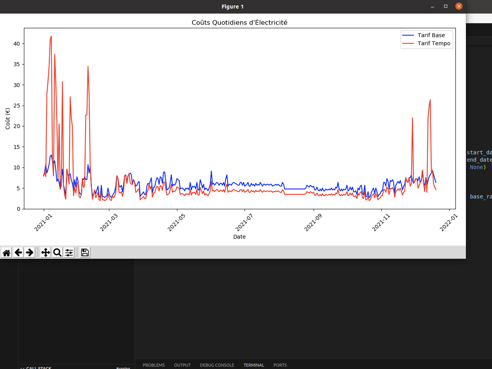

# TempoVision
[](https://www.python.org/) 

[](https://github.com/t3l3machus/Villain/blob/main/LICENSE.md)

## Purpose

The 'Tempo Data Insight' tool is designed to interface with the Tempo API Data from RTE France, offering a comprehensive analysis based on your specific energy consumption patterns. It gathers data about the Tempo tariff's variable pricing, which is categorized by color codes representing different consumption levels throughout the year: red for high, white for moderate, and blue for low consumption days. The program generates detailed projections and visual graphs, allowing users to track their energy usage against these variable rates. By comparing your historical and current consumption against the Tempo offer's pricing structure, it provides an informed estimate on whether the EDF Tempo offer aligns with your energy usage habits and could be financially beneficial for you. This enables consumers to make data-driven decisions about their electricity supply options.


### Video Presentations

**Disclaimer**
:warning: this tool does not certify your EDF prices nor the savings you will make through these calculations.:)

## Preview


## Installation & Usage

Some Explanation about the project(https://blog.lbrs.io/diy/2023/12/02/EDF-Tempo.html)
TempoVision has been explicitly developed and tested on **kali linux**  

```
change in main the dates needed for data extraction
start_date = '2020-01-01'
end_date = '2021-01-20'

launch the script..
python3 main.py

```

## Important Notes
Do not forget to request API secret & Key on RTE site and put it in Constant folder
you can store it in Base64: BASE64_AUTH_STR


## Contributions
I'm not a dev :) Pull requests are generally welcome!
